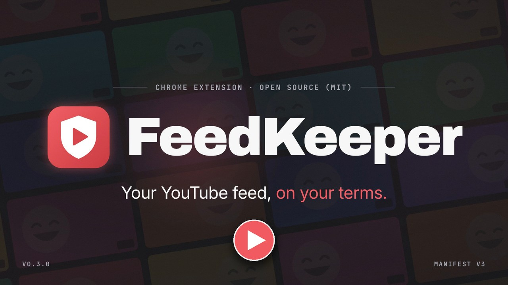
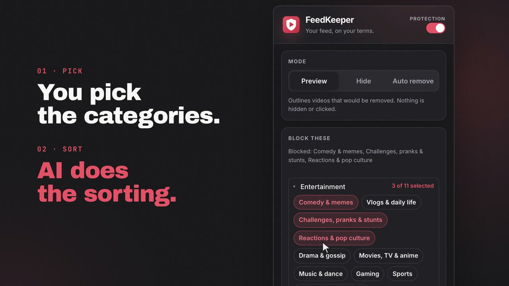
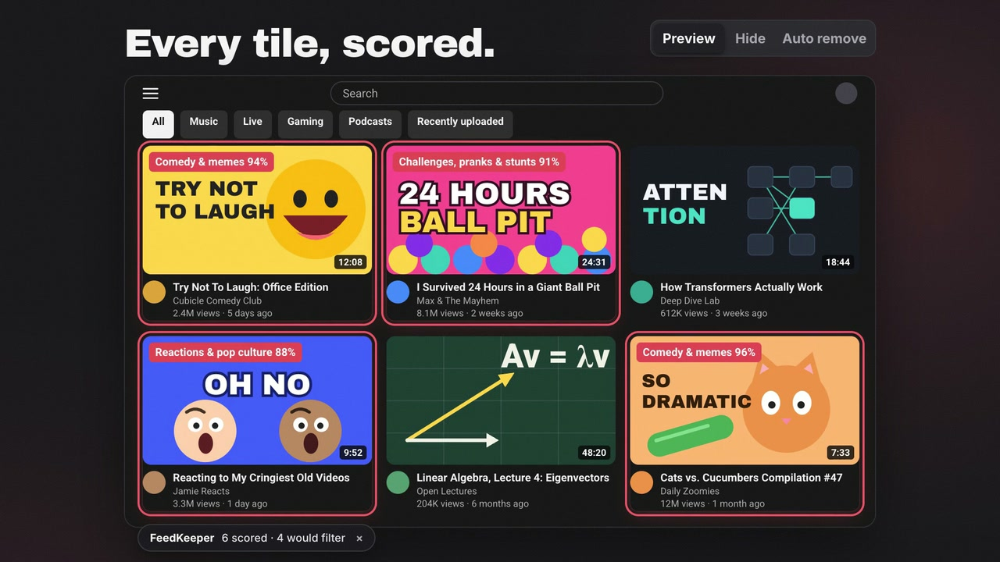
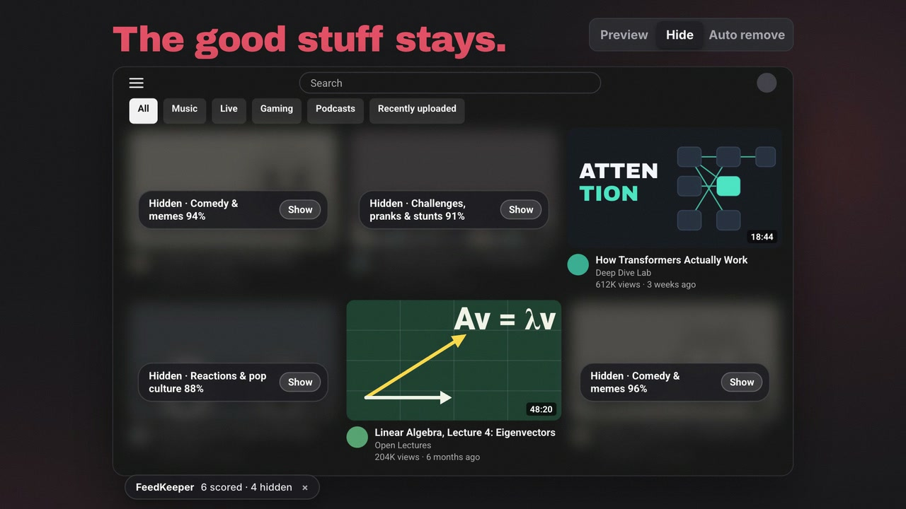
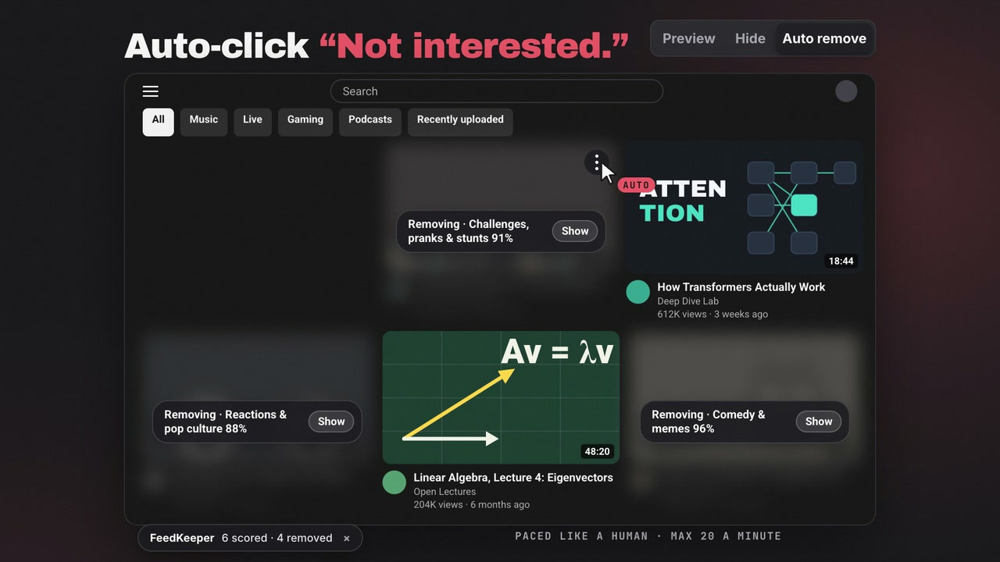
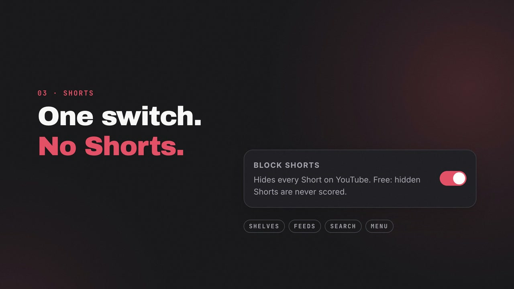
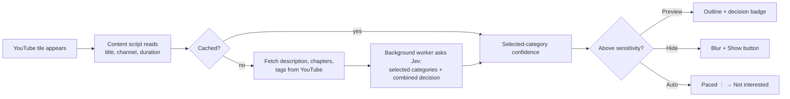

<div align="center">


# FeedKeeper

**Your YouTube feed, on your terms.**

A Chrome extension that quietly removes the kinds of videos you don't want from your YouTube home feed and
"Up next" recommendations. You pick the categories; AI does the sorting.

[](https://github.com/Skynet843/feedkeeper/releases/latest)
[](https://github.com/Skynet843/feedkeeper/actions/workflows/ci.yml)
[](LICENSE)


[](CONTRIBUTING.md)

[Install](#install) · [Features](#features) · [Gallery](#gallery) · [How it works](#how-it-works) · [Privacy](PRIVACY.md) · [Contributing](CONTRIBUTING.md) · [Get help](SUPPORT.md)

<br>

<a href="https://www.youtube.com/watch?v=5CExLTz0u00">
  
</a>

<br><br>

<a href="https://www.youtube.com/watch?v=5CExLTz0u00">
  
</a>

<sub>Under 30 seconds: pick categories, preview the scores, hide, auto remove, block Shorts.</sub>

</div>

> [!IMPORTANT]
> FeedKeeper is an early public release. Start in **Preview** mode, review its scores, and only enable
> **Auto remove** after the selected categories and sensitivity behave the way you expect.

## Why

YouTube's feed learns from every late-night click. One comedy clip turns into a feed full of them, and "just one
video" turns into an hour. Blocking YouTube outright also blocks the lectures, tutorials and news you came for.

FeedKeeper keeps YouTube and filters the feed. Choose *Comedy & memes* and *Challenges, pranks & stunts*, for example,
and those videos are outlined, hidden, or removed with **Not interested** as they appear. YouTube then learns from
those clicks and stops recommending them.

## Features

- **Works where you get pulled in:** the home feed and the recommendations next to a video, including Shorts.
- **Block Shorts:** one switch hides every Short on YouTube (shelves, feeds, search and the Shorts menu entry),
  with no AI calls and no cost.
- **Two filter directions:** block selected categories, or use **Only show selected** for a focused feed.
- **Three modes:** start in **Preview** to see what it would filter, switch to **Hide** to blur matches, and use
  **Auto remove** to click *⋮ → Not interested* for you, paced like a human and capped per minute.
- **21 built-in categories** in four groups (Entertainment, Lifestyle, Current affairs, Learning & growth), plus
  **custom categories**: give a name and a one-line definition, and that definition becomes the question the AI
  answers.
- **Judges more than the title:** the description, chapters, tags and YouTube's own category are used too, with
  sponsor text and links removed first.
- **Combined matching** catches videos whose confidence is split across overlapping selected categories.
- **See why on demand:** hover a video and choose **Why?** to inspect its full category distribution and correct
  the decision for that video or channel.
- **Control without clutter:** sensitivity, channel allow/block lists, free local title rules, per-surface controls,
  reusable profiles, focus sessions, borderline handling, and an optional local decision history.
- **Cheap:** normal scanning asks only about selected categories. Full distributions are requested only when you
  inspect a video, and scores are cached for 14 days.
- **Private:** no server, no analytics. Your key stays in the extension. See [PRIVACY.md](PRIVACY.md).

## Gallery

<table>
  <tr>
    <td width="50%" valign="top"><br><sub><b>1 · Pick.</b> Choose the categories you don't want. Each has a written definition you can edit, or add your own.</sub></td>
    <td width="50%" valign="top"><br><sub><b>2 · Preview.</b> Every tile is scored. Matches get a red outline and a decision badge; nothing is hidden or clicked.</sub></td>
  </tr>
  <tr>
    <td width="50%" valign="top"><br><sub><b>3 · Hide.</b> Matches blur behind a <b>Show</b> button. The videos worth watching stay untouched.</sub></td>
    <td width="50%" valign="top"><br><sub><b>4 · Auto remove.</b> Clicks <i>⋮ → Not interested</i> for you, 1.5–4 s apart and at most 20 a minute, so YouTube learns.</sub></td>
  </tr>
  <tr>
    <td width="50%" valign="top"><br><sub><b>Block Shorts.</b> One switch hides every Short: shelves, feeds, search and the menu entry. Free, because hidden Shorts are never scored.</sub></td>
    <td width="50%" valign="top"><br><sub><b>Cheap.</b> $1 covers roughly 100,000 videos in Hide mode. Your key stays in the extension.</sub></td>
  </tr>
</table>

<sub>These frames come from the <a href="https://www.youtube.com/watch?v=5CExLTz0u00">demo video</a>. They recreate FeedKeeper's interface with made-up videos and channels.</sub>

## Install

FeedKeeper isn't in the Chrome Web Store yet. Installing it takes a minute:

1. Download `feedkeeper-*-chrome.zip` from the [latest release](https://github.com/Skynet843/feedkeeper/releases/latest) and unzip it.
2. Open `chrome://extensions`, turn on **Developer mode** (top right), click **Load unpacked**, and pick the unzipped folder.
3. Get an API key at [openrouter.ai/keys](https://openrouter.ai/keys) and add a few dollars of credit. $1 covers roughly 100,000 videos in Hide mode.
4. Click the FeedKeeper icon, paste the key and click **Save**. It's checked right away.
5. Open [youtube.com](https://www.youtube.com). Preview mode is on by default.

Built and tested in Chrome. Other Chromium browsers (Edge, Brave, Arc) should work too.

| Browser | Status |
| ------- | ------ |
| Chrome | Supported and tested |
| Edge, Brave, Arc | Expected to work; community testing welcome |
| Firefox, Safari | Not supported yet |

<details>
<summary><b>Build from source instead</b></summary>

```sh
git clone https://github.com/Skynet843/feedkeeper.git
cd feedkeeper
pnpm install
pnpm build          # → output/chrome-mv3, load this folder unpacked
```

</details>

## Usage

| Mode        | What happens to a matching video |
| ----------- | -------------------------------- |
| **Preview** | Red outline and a compact decision badge. Nothing is hidden or clicked. Choose **Why?** for the full category distribution. |
| **Hide**    | Blurred with a **Show** button. Nothing is sent to YouTube, so your recommendations don't change. |
| **Auto remove** | Hidden, then *⋮ → Not interested* is clicked, 1.5–4 s apart, at most 20 a minute and 100 per page load. YouTube learns from these clicks. |

With combined matching, FeedKeeper asks whether a video substantially fits any selected definition as one
decision. This avoids missing a video simply because confidence was split between overlapping categories. In
**Block selected**, matches are filtered. In **Only show selected**, videos below the threshold are hidden; that
direction never uses Auto remove. Channel and title rules run locally before paid classification.

<details>
<summary><b>Built-in categories</b></summary>

| Entertainment | Lifestyle | Current affairs | Learning & growth |
| ------------- | --------- | --------------- | ----------------- |
| Comedy & memes ✓ | Food, travel & lifestyle | News & current affairs | Science & education |
| Vlogs & daily life ✓ | Gadgets, cars & shopping | Politics & opinion | Tech & programming |
| Challenges, pranks & stunts ✓ | Health & fitness | | Money & business |
| Reactions & pop culture ✓ | Kids content | | Motivation & self-help |
| Drama & gossip | Religion & spirituality | | |
| Movies, TV & anime | | | |
| Music & dance | | | |
| Gaming | | | |
| Sports | | | |
| Podcasts & interviews | | | |
| True crime & mystery | | | |

✓ selected by default. Each category has a written definition (in [`lib/categories.ts`](lib/categories.ts)) that
you can override or extend with **+ Custom category**.

</details>

## How it works



Classification uses [TypeSafe Jev](https://openrouter.ai/typesafe) through OpenRouter's System One API. Instead
of generating text, Jev answers each category as a probability (a `noul` question). Selected categories and the
combined decision go in **one request per video**. Remaining category scores are requested and cached only when
you choose **Why?**. Editing a definition re-asks only its affected score and the combined decision.

The extension asks for only two capabilities: local extension storage and network access to `openrouter.ai`.
It has no FeedKeeper server, analytics SDK, or runtime package dependencies. Read the
[architecture and trust boundaries](docs/ARCHITECTURE.md) for the full data flow.

| Path | What it does |
| ---- | ------------ |
| [`entrypoints/youtube.content/`](entrypoints/youtube.content) | Finds tiles on the home feed and watch page, draws overlays, runs the paced click queue |
| [`entrypoints/background.ts`](entrypoints/background.ts) | Makes every Jev request; the YouTube page never receives the API key |
| [`entrypoints/popup/`](entrypoints/popup), [`entrypoints/options/`](entrypoints/options) | Popup and Settings page |
| [`lib/classifier.ts`](lib/classifier.ts) | Cache, concurrency limit, per-category score keys |
| [`lib/request.ts`](lib/request.ts), [`lib/video-text.ts`](lib/video-text.ts) | Builds what Jev sees, strips sponsor blocks and links |
| [`lib/selectors.ts`](lib/selectors.ts) | **Every YouTube selector. When YouTube changes its markup, fix it here.** |
| [`scripts/jev-spike.mjs`](scripts/jev-spike.mjs) | Scores sample titles or real video IDs from the terminal |

## Development

```sh
pnpm dev        # Chrome with hot reload
pnpm compile    # type-check
pnpm build      # production build → output/chrome-mv3
pnpm zip        # store-ready zip → output/feedkeeper-<version>-chrome.zip

OPENROUTER_API_KEY=sk-or-... pnpm spike --video <id>   # see exactly what Jev saw and scored
```

Built with [WXT](https://wxt.dev) and TypeScript, with no runtime dependencies. Tagging `v*` publishes a GitHub
release with the zip attached.

## Roadmap

- [ ] Chrome Web Store and Firefox Add-ons listings
- [ ] Search results and the Shorts player
- [x] Separate on/off for the home feed and the sidebar
- [x] Temporary profile-based focus sessions
- [ ] Recurring time-based rules (e.g. strict after 10 pm)
- [ ] Import and export settings

Ideas and PRs are welcome. See [CONTRIBUTING.md](CONTRIBUTING.md).

## Community

- [Ask a question or share an idea](https://github.com/Skynet843/feedkeeper/discussions)
- [Report a bug](https://github.com/Skynet843/feedkeeper/issues/new?template=bug_report.yml)
- [Report a YouTube layout break](https://github.com/Skynet843/feedkeeper/issues/new?template=youtube_layout.yml)
- [Read the support guide](SUPPORT.md)
- [Report a security issue privately](SECURITY.md)

## FAQ

<details>
<summary><b>Does it get my account banned or flagged?</b></summary>

Auto remove clicks the same *Not interested* button you would, spaced 1.5–4 seconds apart and capped per minute
and per page. Preview and Hide never click anything.
</details>

<details>
<summary><b>Why do I need my own API key?</b></summary>

There's no FeedKeeper server, so no one else sees your feed and nothing ever needs a subscription. You pay
OpenRouter directly, usually a few cents a month.
</details>

<details>
<summary><b>A video was scored wrong.</b></summary>

Open the popup, check the category's definition, and make it more specific, or add a custom category. To see
exactly what the AI was given, run `pnpm spike --video <id>`. If a built-in definition is off, please open an
issue with the video link.
</details>

## License

[MIT](LICENSE). FeedKeeper isn't affiliated with or endorsed by YouTube or Google.
