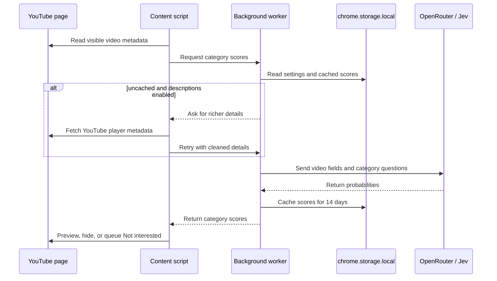

# FeedKeeper architecture

FeedKeeper is a Manifest V3 browser extension built with WXT and strict TypeScript. It has no FeedKeeper backend
and no runtime package dependencies. The browser extension, YouTube, and OpenRouter are the only moving parts.

## Runtime flow

The content script scans only the YouTube home feed and the watch-page recommendation sidebar. It reacts to
YouTube's client-side navigation and re-rendering, then decorates matching tiles without replacing YouTube's
own UI. The one exception is **Block Shorts**: it injects a stylesheet built from the Shorts selectors that hides
Shorts on every YouTube page. Shorts are never classified, whether or not they are blocked.

## Main components

| Component | Responsibility |
| --------- | -------------- |
| `entrypoints/youtube.content/` | Finds video tiles, requests scores, renders overlays, and owns the paced action queue |
| `entrypoints/background.ts` | Receives extension messages, deduplicates in-flight work, and calls the classifier |
| `lib/classifier.ts` | Handles caching, concurrency, score-key versioning, and Jev requests |
| `lib/details.ts` and `lib/video-text.ts` | Fetch and clean descriptions, chapters, tags, and uploader metadata |
| `lib/actions.ts` and `lib/queue.ts` | Find YouTube's menu action and enforce delay, per-minute, and per-session limits |
| `lib/storage.ts` | Merges settings across versions and serializes daily-stat updates |
| `lib/selectors.ts` | Centralizes markup selectors and localized Not interested labels |
| `entrypoints/popup/` and `entrypoints/options/` | Configure direction, modes, categories, local rules, profiles, focus sessions, surfaces, history, and pacing |

## Data and trust boundaries

### Stored locally

- the OpenRouter API key, user settings, profiles, local rules, optional latest-200 decision history, and up to
  500 corrections (Always show/hide choices with the filter they were judged under) for exporting as eval cases
- category scores and cleaned video details, expiring after 14 days
- daily counters for scanned, matched, actioned, requests, tokens, and estimated cost

All of this lives in `chrome.storage.local`. **Clear cached scores** removes classification cache entries;
uninstalling the extension removes the extension's local storage.

### Sent to OpenRouter

The background worker sends the fields listed in [the privacy policy](../PRIVACY.md): title, channel, duration,
and—when enabled—cleaned description, chapters, tags, and YouTube category. Questions are generated from
the enabled category definitions. The user's OpenRouter key authorizes this request.

### Sent to YouTube

When richer details are enabled, FeedKeeper requests the video's player metadata from YouTube. Only Auto remove
opens the tile menu and clicks YouTube's own **Not interested** action. Preview and Hide do not send preference
actions to YouTube.

The YouTube page cannot read extension storage. FeedKeeper does not place the API key in the page DOM or send it
to YouTube.

## Reliability controls

- One in-flight classification is shared by duplicate tiles for the same video and request scope.
- At most four uncached classifications run concurrently.
- Cached entries expire after 14 days; category-definition changes invalidate only the affected score.
- Auto remove waits 1.5–4 seconds by default, caps actions per minute and session, and backs off while a user menu
  is open.
- Tile identity is checked again after asynchronous work because YouTube recycles DOM nodes.
- Errors surface in the on-page status pill and are retried after a delay.
- Allow-only filtering never triggers automated **Not interested** clicks.
- Full category distributions are opt-in per video; normal scanning asks only the combined decision (or each selected category when combined matching is off or one category is selected).

## Extension permissions

| Permission | Why it is needed |
| ---------- | ---------------- |
| `storage` | Save settings, the API key, cached scores, and daily counters |
| `unlimitedStorage` | Keep the 14-day cache useful for larger feeds without a small storage quota |
| `https://openrouter.ai/*` | Make classification and API-key test requests from the background worker |
| YouTube content-script match | Read supported feeds and render FeedKeeper controls on `youtube.com` |

## Making changes safely

- Keep every YouTube selector and translated **Not interested** label in `lib/selectors.ts`.
- Keep external API calls in the background worker path.
- Keep automated clicks behind `PacedQueue` and preserve its caps.
- Update `QUESTION_VERSION` when global question wording changes.
- Update `PRIVACY.md` and this document before adding a new host, data field, or persistence mechanism.

See [CONTRIBUTING.md](../CONTRIBUTING.md) for setup, validation, and pull-request expectations.
